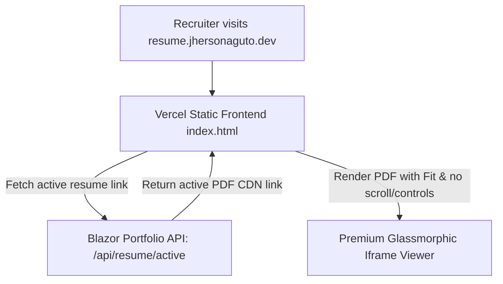

# Implementation Plan: Enforcing Subdomain Isolation with Vercel Static Frontend & Blazor CMS API

This plan outlines the architecture and step-by-step implementation for migrating the resume preview page (`resume.jhersonaguto.dev`) to a dedicated, high-performance static deployment (Vercel) while keeping it fully integrated with your Blazor Server CMS.

---

## 1. System Architecture



### Key Technical Specs:
- **No Page Scroll & No PDF Scroll**: The page locks exactly to `100vh` and uses the `#view=Fit` and `#scrollbar=0` PDF parameters to scale the document exactly to the viewport without scrollbars.
- **No Controls**: The PDF toolbar and navigation panes are completely hidden using `#toolbar=0` and `#navpanes=0`.
- **Vercel Deployed**: Completely independent, static, free, and hosted on Vercel.
- **CORS Enabled**: The Blazor backend permits Vercel domain requests to fetch the JSON payload.

---

## 2. Implementation Phases

### Phase 1: Blazor Portfolio API & CORS Configuration
1. **CORS Registration**:
   Register a CORS policy in `Program.cs` allowing any origin (or Vercel domains) to read the API.
2. **Create JSON Endpoint**:
   Add a lightweight Minimal API route:
   ```csharp
   app.MapGet("/api/resume/active", async (BlazorPortfolio.Services.ContentService svc) =>
   {
       var active = await svc.GetActiveResumeAsync();
       if (active == null) return Results.NotFound();

       // Convert on-the-fly to jsDelivr CDN link format for optimal loading
       var fileUrl = active.FileUrl;
       if (fileUrl.Contains("raw.githubusercontent.com"))
       {
           fileUrl = fileUrl.Replace("raw.githubusercontent.com/", "cdn.jsdelivr.net/gh/")
                            .Replace("/main/", "@main/")
                            .Replace("/master/", "@master/");
       }

       return Results.Ok(new { fileUrl });
   }).RequireCors("AllowAll"); // Or dedicated policy
   ```

### Phase 2: Create Vercel Static Subdomain Project
1. **Initialize Project Directory**:
   Create a new folder `resume-subdomain` in your workspace.
2. **Create `index.html`**:
   Write a single high-performance file containing:
   - Modern dark glassmorphic CSS styling.
   - Dynamic JS to fetch `https://jhersonaguto.dev/api/resume/active`.
   - Embed iframe with parameters: `#toolbar=0&navpanes=0&scrollbar=0&view=Fit`.
   - Layout locked to exactly `100vh`/`100dvh` with `overflow: hidden`.

### Phase 3: Cleanup Blazor App Routing
1. **Remove Local `/resume` Page**:
   Delete `Components/Pages/ResumePage.razor` (or rewrite it to redirect visitors to `https://resume.jhersonaguto.dev/`).
2. **Update Navbar & Homepage Links**:
   Make sure the "Resume" buttons point directly to the subdomain `https://resume.jhersonaguto.dev/`.

---

## 3. Verification Plan

- **Compilation**: Run `dotnet build` to verify the new API endpoint compiles cleanly.
- **API Response**: Visit `https://localhost:XXXX/api/resume/active` to verify the JSON output.
- **Static Preview**: Open `index.html` locally in the browser to verify full-screen scaling and lack of scrollbars.
