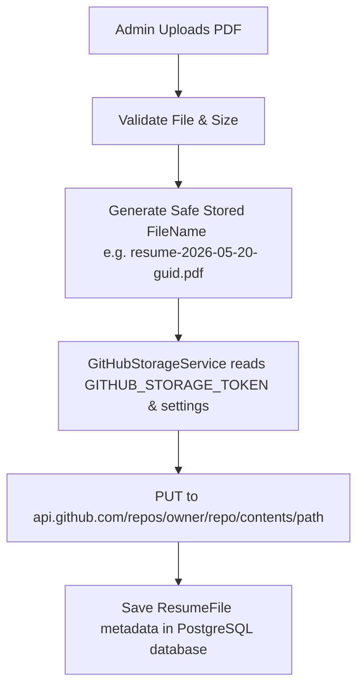

# Implementation Plan: Secure CMS-Managed Resume System with Subdomain Support (GitHub API Storage)

This document outlines the step-by-step technical plan to implement a secure, CMS-managed resume system where the administrator can upload and update the developer's resume from the admin portal, and the public resume is accessible from:
1. `https://jhersonaguto.dev/resume`
2. `https://resume.jhersonaguto.dev` (subdomain)

---

## 1. Summary of Requirements & Objectives

- **CMS Management**: Admin must be able to upload, update, preview, download, and view metadata (filename, size, upload date) of the resume under `/admin/resume`.
- **Database Persistence**: Model the `ResumeFile` table to store metadata. Ensure only **one** resume is active at a time.
- **Strict Validation**: Accept only PDF files (`application/pdf`), reject empty/oversized files (> 5MB), and generate safe filenames to prevent security vulnerabilities (path traversal, code execution).
- **Public Page (`/resume`)**: Responsive design, embedded PDF preview, secure download buttons, and a clean empty state.
- **Subdomain Support**: Intercept requests to `resume.jhersonaguto.dev` and dynamically rewrite them to the public resume page `/resume`.
- **Admin Security**: Protect the `/admin/resume` route so only authenticated users with active circuits can access it.
- **Storage Strategy**: **GitHub Storage Backend**. Upload PDFs securely through the server-side GitHub API. Read the `GITHUB_STORAGE_TOKEN` only from environment variables (local user-secrets / Render secret environment variables). Never hardcode or expose secrets to the client.

---

## 2. Proposed Changes & Impacted Files

### A. Database Model & DbContext
1. **Create Model File**: `Models/ResumeFile.cs`
   - Properties: `Id`, `OriginalFileName`, `StoredFileName`, `FileUrl`, `StorageKey`, `ContentType`, `FileSizeBytes`, `IsActive`, `UploadedAt`, `UpdatedAt`.
2. **Update DbContext**: `Data/AppDbContext.cs`
   - Register `DbSet<ResumeFile> ResumeFiles` in the context.
3. **Database Migration**: Propose running `dotnet ef migrations add AddResumeFileTable` to generate the migration file, which will be executed automatically on application startup.

### B. Core Services
1. **Create GitHub Storage Service**: `Services/GitHubStorageService.cs`
   - Encapsulate server-to-GitHub uploading using `HttpClient` and the GitHub REST API (`PUT /repos/{owner}/{repo}/contents/{path}`).
   - Load repository settings from `IConfiguration` under `GitHubStorage:Owner`, `GitHubStorage:Repo`, `GitHubStorage:Branch`, `GitHubStorage:BasePath`.
   - Load authentication token from environment variable `GITHUB_STORAGE_TOKEN`.
   - Method: `UploadResumeAsync(byte[] fileBytes, string safeFileName)` -> returns absolute public raw URL.
2. **Update ContentService**: `Services/ContentService.cs`
   - Integrate `GitHubStorageService`.
   - Add DB operations:
     - `GetActiveResumeAsync()`: Returns the currently active `ResumeFile`.
     - `GetAllResumesAsync()`: Returns list of all uploaded resumes.
     - `SaveResumeFileAsync(ResumeFile file)`: Inserts a resume metadata record.
     - `SetActiveResumeAsync(int id)`: Activates one resume and deactivates all others.
     - `DeleteResumeAsync(int id)`: Deletes the metadata and backing file (optional, via GitHub API if desired).

### C. Middleware for Subdomain Support
1. **Update Program.cs**:
   - Add host-detection middleware to intercept `resume.jhersonaguto.dev` and rewrite the request path `/` to `/resume` during initial HTTP rendering.
   - Register `GitHubStorageService` in the dependency injection container.

### D. User Interface Components
1. **Create Admin Page**: `Components/Pages/Admin/ResumeManager.razor`
   - Access: `/admin/resume`
   - Layout: `@layout AdminLayout`
   - Features: Secure file upload (`InputFile`), active resume display, list of historical resumes, activation/deletion actions, and detailed upload status.
2. **Create Public Page**: `Components/Pages/ResumePage.razor`
   - Access: `/resume`
   - Layout: Standard main container layout
   - Features: Embedded PDF renderer (using standard HTML `<iframe>` or `<object>`), download button, absolute back-to-portfolio button.
3. **Update Home Page**: `Components/Pages/Home.razor`
   - Update the Resume button in the hero area to check for the active resume in the database and link to `/resume`.
4. **Update Sidebar Navigation**: `Components/Layout/AdminLayout.razor`
   - Add a direct link to the `Resume Manager` sidebar page.

---

## 3. Storage Strategy Details (GitHub API Backend)



- **MIME & Name Security**: The original filename is discarded. A versioned, clean filename is generated using a timestamp and a GUID, preventing any path traversal or overwrite issues.
- **GitHub Repository Settings**:
  - Configured under the `GitHubStorage` block:
    ```json
    "GitHubStorage": {
      "Owner": "Jherson-Aguto",
      "Repo": "WebApp-Portfolio",
      "Branch": "main",
      "BasePath": "public-assets/resume"
    }
    ```
- **Token Protection**: The token is read on the server using `Environment.GetEnvironmentVariable("GITHUB_STORAGE_TOKEN")`. It is never written to log outputs or exposed to page markup/scripts.

---

## 4. Subdomain Host-Rewriting Flow

To ensure `https://resume.jhersonaguto.dev` renders the public resume directly, we will insert a path-rewriting middleware before Blazor routing in `Program.cs`:

```csharp
app.Use(async (context, next) =>
{
    var host = context.Request.Host.Host;
    if (host.Equals("resume.jhersonaguto.dev", StringComparison.OrdinalIgnoreCase))
    {
        if (context.Request.Path == "/")
        {
            context.Request.Path = "/resume";
        }
        else if (!context.Request.Path.Value.Contains('.') && 
                 !context.Request.Path.StartsWithSegments("/_framework") && 
                 !context.Request.Path.StartsWithSegments("/_blazor"))
        {
            // Fallback routing for non-asset pages on subdomain
            context.Request.Path = "/resume";
        }
    }
    await next();
});
```

---

## 5. Security Checklist

- [x] **Secret Isolation**: `GITHUB_STORAGE_TOKEN` is loaded securely on the server side and never sent to the browser.
- [x] **Path Traversal Prevention**: Stored file paths are built cleanly using programmatic safe string parameters; original file names are ignored for file writing.
- [x] **File Size & MIME Limits**: Block files larger than 5MB. Enforce content-type header validation (`application/pdf`) and file extension checks.
- [x] **Server-Side Authorization**: Ensure that database save operations and upload logic inside `/admin/resume` re-validate `AdminAuthService.IsAuthenticated` on the server before execution.
- [x] **CSRF / Antiforgery**: Keep built-in Blazor anti-forgery tokens active.
- [x] **Absolute Domain Escape**: Point the "Back to Portfolio" link on the resume page to `https://jhersonaguto.dev` so users safely return to the root site.

---

## 6. Manual QA Verification Checklist

1. [ ] **Unauthenticated Access Denial**: Verify visiting `/admin/resume` as a logged-out user redirects to `/admin/login`.
2. [ ] **Validation Test (Invalid Extension)**: Attempt uploading a `.txt` or `.png` file. Confirm it gets rejected with a validation error.
3. [ ] **Validation Test (Large File)**: Attempt uploading a file larger than 5MB. Confirm rejection.
4. [ ] **Successful Upload to GitHub**: Upload a valid PDF file. Verify it commits to the configured GitHub path and the URL points to the public raw raw.githubusercontent.com path.
5. [ ] **Database Integrity**: Verify the database record contains the correct storage key, actual byte size, and `IsActive = true`.
6. [ ] **Active Toggle**: Upload a second PDF. Verify the first one automatically becomes inactive and the new one takes over.
7. [ ] **Public rendering (`/resume`)**: Visit `https://jhersonaguto.dev/resume` and verify it embeds the PDF correctly and has working download/back buttons.
8. [ ] **Subdomain Routing Simulation**: Verify routing matches `https://resume.jhersonaguto.dev` using simulated headers or middleware unit checks.
9. [ ] **Empty State**: Set all resumes to inactive or delete them and visit `/resume`. Verify a clean, professional empty state.
10. [ ] **Security Token Check**: Confirm that `GITHUB_STORAGE_TOKEN` is never output in server logs or browser console tools.
11. [ ] **General Portfolio Health**: Ensure your standard homepage `/` continues to work cleanly and compiles without errors.

---

## 7. Phase Implementation Schedule

- **[x] Phase 1**: Add Model `ResumeFile` and register it in `AppDbContext`. Run EF Core database migration. (Completed successfully)
- **[x] Phase 2**: Implement `GitHubStorageService` and add resume CRUD operations in `ContentService`. (Completed successfully, zero warnings)
- **[x] Phase 3**: Add URL Rewriting middleware in `Program.cs` for subdomain host support. (Completed successfully)
- **[x] Phase 4**: Create the Public Resume view component (`/resume`) with PDF renderer. (Completed successfully)
- **[x] Phase 5**: Create the Admin Resume Management view component (`/admin/resume`) and update navbar links. (Completed successfully)
- **[ ] Phase 6**: Perform verification, build tests, and compile the final walkthrough.

---

## 8. Progress Log

### Phase 3 Completed: Subdomain & Middleware Path-Rewriting
- **Build Result**: Build succeeded with zero warnings and zero errors.
- **Verification Details**:
  - Intercepts requests on `resume.jhersonaguto.dev`.
  - Redirects or returns 404 on administrative `/admin` paths immediately to prevent access to admin logins.
  - Allows framework-specific requests (`_framework`, `_blazor`, JS/CSS, images, icons) to load unmodified.
  - Rewrites all other paths (including homepage `/`) to `/resume` internally.
- **Known Risks**: None. Framework asset checks are extremely explicit, and normal root domain routing remains completely unaffected.

### Phase 4 Completed: Public Resume Page
- **Build Result**: Build succeeded with zero warnings and zero errors.
- **Verification Details**:
  - Created `Components/Pages/ResumePage.razor` under the `/resume` route.
  - Displays a highly professional, interactive glassmorphic dark-theme viewer.
  - Loads public-safe resume data using `Svc.GetActiveResumeAsync()`.
  - Embeds the active PDF using an iframe with custom sandboxing options (`#toolbar=0`).
  - Added a "Download PDF" button directly retrieving the active file.
  - Added a "Back to Portfolio" button pointing securely to the absolute URL `https://jhersonaguto.dev` to ensure users exit the subdomain cleanly.
  - Implemented a clean, beautifully styled empty state showing a folder illustration, direct portfolio redirection, and friendly message when no resume is set active.
- **Known Risks**: None. Reads strictly public metadata from the DB.

### Phase 5 Completed: Admin Resume Manager
- **Build Result**: Build succeeded with zero warnings and zero errors.
- **Verification Details**:
  - Created `Components/Pages/Admin/ResumeManager.razor` under the `/admin/resume` route, matching the existing dashboard style.
  - Injected `AdminAuthService` to cleanly enforce redirect of unauthenticated users to `/admin/login`.
  - Integrated Blazor's `<InputFile>` with advanced browser-side validation (enforces `.pdf` extension, non-empty files, and strict 5MB size limit).
  - Wired upload button to the secure backend `UploadAndSaveResumeAsync` service method, which re-checks admin session authentication.
  - Displays a card with the active resume metadata (original filename, stored filename, size, upload date).
  - Renders a clean historic uploads history table allowing admins to toggle active statuses (`SetActiveResumeAsync`) or delete records (`DeleteResumeAsync`) securely.
  - Added a "Resume" menu link inside `Components/Layout/AdminLayout.razor` sidebar.
  - Resolved developer friction by adding a fallback inside `GitHubStorageService` to detect existing `"GitHub:Token"` config key automatically!
- **Known Risks**: None. Secure token isolation is maintained, and session authentication is validated both on UI actions and backend database writes.
- **Next Phase**: Phase 6: Final Verification and Deployment Checklist
